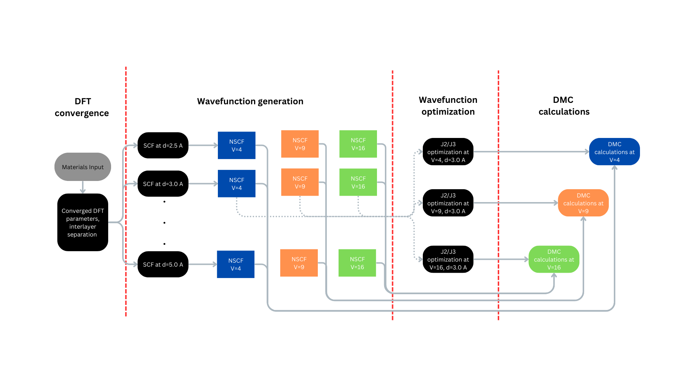
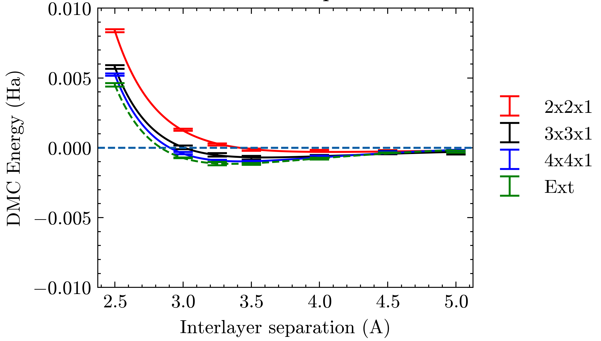

Binding energy of bilayer hexagonal BN 
=================

.. _hBN:

Aim
------------

The aim of this tutorial is to provide users with publication quality examples on calculating binding energies of layered materials. 

Prerequisites
----------------
This workflow assumes that you have completed the installation of Quantum Espresso (QE), QMCPACK and Nexus. Otherwise, please refer to `qmcpack.org <https://qmcpack.org>`_ for further instructions on the installation of these software. 
A basic knowledge of Nexus suite (e.g. loading modules, basic elements of Nexus workflows) is also required. Please refer to `nexus-workflows.readthedocs.io <https://nexus-workflows.readthedocs.io/>`_.

Calculations that would need to be performed in QE
^^^^^^^^^^^^^^^^

* Kinetic energy cutoff convergence study on the pseudopotentials used in the materials. Currently (2025), we mainly utilize `ccECP` potentials from `pseudopotential-library <https://pseudopotentiallibrary.org>`_. These pseudopotentials typically require very large (400-700 Ry) kinetic energy cutoff for accurate calculations. 

* K-point convergence study in DFT: We assume that the k-point sampling that converges the DFT total energy will be sufficient to provide similar accuracy in QMC calculations. 

Calculations that would need to be performed in QMCPACK
^^^^^^^^^^^^^^^^

* Hybrid representation calculations: Spline representation of the wavefunction can be demanding on the memory which is often more scarce for GPUs. Currently (2024), most efficient QMCPACK application stores the wavefunction memory untis that are most easily accessible to the GPU units. Therefore, hybrid representation could allow separating core and valence regions of a material to achieve a memory reduction typically around 90 \%.

Calculation steps
----------------

* Convergence tests on BN shows that a kinetic energy cutoff of 400 Ry and a kpoint grid of (:math:`8\times8\times1`) is sufficient to achieve a resolution of 1 meV/atom on the DFT total energy. 

* Self-consistent field calculation of the primitive cell of the material calculated using converged DFT parameters as above for interlayer separations of 2.5, 3.0, 3.25, 3.5, 4.0, 4.5 and 5.0 Angstroms. 

* Non self-consistent field calculations of the primitive cell for each interlayer separation, which then will be unfolded to supercells (V = 4, 9, 16; M = (2x2x1), (3x3x1), (4x4x1)) for finite size extrapolation in QMCPACK. Here, V is the volume factor compared to primitive supercell, while M is the diagonal supercell matrix used to tile the primitive cell.  Different choices can be explored here such that non-diagonal supercell matrices (M) can also be utilized.  However, for 2D materials we expect that the coulomb interaction screened more weakly compared to 3D materials, hence using diagonal supercells could provide better cancellation of errors reducing the finite size effects. 

* Jastrow optimization for each supercell size at a single interlayer separation

    * Variance minimization using 2-body Jastrows

    * Mixed energy/reweighed variance minimization (0.95/0.05) using 2-body Jastrows

    * Mixed energy/reweighed variance minimization (0.95/0.05) using 3-body Jastrows

* Twist-averaged DMC calculations

   Schematic of DFT-VMC-DMC calculation workflow for the bilayer binding energy of BN

Contents of working directory
----------------
.. code-block:: text
  
  /BN_tutorial
  ├── pseudos/ 
  │   ├── B.ccECP.upf 
  │   ├── B.ccECP.xml 
  │   ├── N.ccECP.upf 
  │   └── N.ccECP.xml 
  ├── README 
  ├── run_library.py 
  ├── run.py 
  └── structures/ 
      ├── hBN_d_2500.xsf 
      ├── hBN_d_3000.xsf 
      ├── hBN_d_3250.xsf 
      ├── hBN_d_3500.xsf 
      ├── hBN_d_4000.xsf 
      ├── hBN_d_4500.xsf 
      ├── hBN_d_5000.xsf 
      └── hBN_mono.xsf 

Complete Nexus scripts
----------------

Workflow running script (run.py)
^^^^^^^^^^^^^^^^^^^^^^^^^^^
.. code-block:: python

  #!/usr/bin/env python
  # user library imports
  from run_library import get_dft_settings, get_qmc_settings
  # nexus imports
  from nexus import run_project, read_structure, obj
  from nexus import generate_physical_system
  from nexus import generate_pwscf
  from nexus import generate_pw2qmcpack
  from nexus import generate_qmcpack

  # structure files and interlayer separations in Angstroms
  structures = {3.0:  'structures/hBN_d_3000.xsf',
  		  2.5:  'structures/hBN_d_2500.xsf',                
  		  3.25: 'structures/hBN_d_3250.xsf',
  		  3.5:  'structures/hBN_d_3500.xsf',
  		  4.0:  'structures/hBN_d_4000.xsf',
  		  4.5:  'structures/hBN_d_4500.xsf',
  		  5.0:  'structures/hBN_d_5000.xsf',
  		  'mono' : 'structures/hBN_mono.xsf'}
  interlayer_separations  = list(structures.keys())

  # Supercell tiling vectors and respective kgrids
  tiling_vectors          = [(2,2,1), (3,3,1), (4,4,1)]
  tiling_kgrids           = {(2,2,1):(4,4,1), 
  						  (3,3,1):(2,2,1), 
  						  (4,4,1):(2,2,1)}

  # DFT and QMC settings shared across all calculations
  system_shared = obj(
    B        = 3,        # Boron PP valency
    N        = 5,        # Nitrogen PP valency
    net_spin = 0         # Net spin of the system
  )

  dft_shared = obj(
    kgrid    = (8,8,1),  # K-point grid for DFT calculations
    ecutwfc  = 400,      # Plane-wave cutoff energy in Rydberg
    pseudos  = 'B.ccECP.upf N.ccECP.upf'.split()  # DFT PP files for Boron and Nitrogen
  )

  qmc_shared = obj(
      # Hybrid representation cutoff radius for Boron and Nitrogen in atomic units (a.u.)
      hybrid_rcut  = obj(B=1.1, N=1.1),  
      # Maximum angular momentum for hybrid representation for Boron and Nitrogen
      hybrid_lmax  = obj(B=5, N=5),     
      # Blip-spline Mesh factor for QMC calculations
      meshfactor   = 0.5,               
      # Pseudopotential files for QMC calculations
      pseudos      = 'B.ccECP.xml  N.ccECP.xml'.split()  
  )

  # SCF, NSCF and PW2QMCPACK settings
  scf_shared, nscf_shared, conv_shared = get_dft_settings(**dft_shared)

  # Binding energy workflow start 
  for d in interlayer_separations:
      # Convert interlayer separation to an int for file naming
      if isinstance(d, (int, float)):
          d_name = int(d*1000)
      else:
          d_name = d

      scf_path = 'scf_{}'.format(d_name)
      
      # Generate the primitive cell system
      prim_system = generate_physical_system(
          structure = read_structure(structures[d]),
          **system_shared
          )
      # SCF calculation
      scf_run = generate_pwscf(
          system = prim_system,
          path = scf_path,
          **scf_shared
          )
      for t in tiling_vectors:
          # Directory for the NSCF calculation
          nscf_path = 'nscf_{}_{}'.format(d_name, t[0])
          
          # Generate the supercell system
          tiled_system = generate_physical_system(
              structure = read_structure(structures[d]),
              tiling   = t,
              kgrid    = tiling_kgrids[t],
              **system_shared
          )
          # NSCF calculation
          nscf_run = generate_pwscf(
              system = tiled_system,
              path = nscf_path,
              **nscf_shared
          )        
          # PW2QMCPACK conversion calculation
          conv_run = generate_pw2qmcpack(
              path         = nscf_path,    # Use the same path as the NSCF calculation
              dependencies = (nscf_run, 'orbitals'),
              **conv_shared
          )        

          dmc_path = 'dmc_{}_{}'.format(d_name, t[0])
          
          # Optimize jastrows using the first structure listed in interlayer_separations
          # In this example, this is d == 3.0 since dictionary keys are always ordered in Python 3.7+
          if d == interlayer_separations[0]: 
              j2_path = 'j2_{}_{}'.format(d_name, t[0])
              j3_path = 'j3_{}_{}'.format(d_name, t[0])
              # J2, J3 optimizations and DMC calculation settings
              # Here each "settings" object is specific to the system size
              j2_settings, j3_settings, dmc_settings  = get_qmc_settings(system = tiled_system, 
                                                                          **qmc_shared)
              
              # J2 optimization calculation
              j2_run = generate_qmcpack(path = j2_path,
                                      dependencies = (conv_run, 'orbitals'),
                                      **j2_settings)
              # J3 optimization calculation
              j3_run = generate_qmcpack(path = j3_path,
                                      dependencies = [(j2_run, 'jastrow'), (conv_run, 'orbitals')],
                                      **j3_settings)
          else:
              # If interlayer separation is not 2.5, use the optimized Jastrow parameters 
              # Angstrom separation
              # Ignore the J2 and J3 settings returned from this function
              _, _, dmc_settings = get_qmc_settings(system = tiled_system, **qmc_shared)

          # DMC calculation
          dmc_run = generate_qmcpack(path = dmc_path,
                                      dependencies = [(j3_run, 'jastrow'),(conv_run, 'orbitals')],
                                      **dmc_settings)
  run_project()

Workflow library script (run_library.py)
^^^^^^^^^^^^^^^^^^^^^^^^^^^
.. _hBN_wf_script:

.. code-block:: python

  #!/usr/bin/env python
  # nexus imports
  from nexus import Job, obj
  from nexus import settings
  from nexus import linear, loop, vmc, dmc
  from qmcpack_input import spindensity
  # general settings for nexus
  settings(
      pseudo_dir    = './pseudos',
      status_only   = 0,                    # only show status of runs
      generate_only = 0,                    # only make input files
      sleep         = 3,                    # check on runs every 3 secondsa
      machine       = 'perlmutter',         # Perlmutter NERSC machine
      account       = '<account_name>',     # User account name    
      )

  def get_dft_settings(kgrid     = None, 
                       ecutwfc   = None,
                       pseudos   = None,
                       start_mag = None,
                       hubbard   = None,
                       tot_magnetization = None):
      

      if settings.machine == 'perlmutter':
          qe_modules = '' # Modules used to build QE
          qe_bin     = '' # QE build directory    
          dft_job = Job(cores  = 4,
                        threads= 1,
                        hours  = 12,
                        app    = qe_bin+'/pw.x',
                        constraints = 'cpu', # Default
                        presub= qe_modules)
          conv_job = Job(cores=1,
                         hours=1,
                         app='/pw2qmcpack.x',
                         constraints = 'cpu',
                         presub=qe_modules)
      else:
          print('Error: Unknown computer for DFT, using {}'.format(settings.machine))
          exit()

      qe_shared = obj(
          job          = dft_job,
          input_type   = 'generic',
          ecutwfc      = ecutwfc,          # DFT planewave energy cutoff
          input_DFT    = 'PBE',            # DFT functional
          conv_thr     = 1e-8,             # SCF convergence threshold
          wf_collect   = True,             # write orbitals
          pseudos      = pseudos,          # QE Pseudopotentials
          start_mag    = start_mag,        # Starting magnetization
          hubbard      = hubbard,          # Hubbard U parameters
          occupations  = 'smearing',       # Occupation scheme
          smearing     = 'gauss',          # Smearing type
          degauss      = 0.001,            # Smearing widt
          tot_magnetization = tot_magnetization
      )

      scf_shared = obj(
          nosym        = False,            # use symmetry
          identifier   = 'scf',            # identifier/file prefix
          calculation  = 'scf',            # perform scf calculation
          kgrid        = kgrid,            # Converged DFT k-grid
          **qe_shared
      )

      nscf_shared = obj(
          nosym        = True,             # don't use symmetry
          identifier   = 'nscf',           # identifier/file prefix
          calculation  = 'nscf',           # perform nscf calculation
          diagonalization = 'cg',          # Diagonalization method
          **qe_shared
      )    

      conv_shared = obj(
              identifier   = 'conv',           # identifier/file prefix
              job          = conv_job,         # Job object for PW2QMCPACK
              write_psir   = False,            # Don't write psir
      )

      return scf_shared, nscf_shared, conv_shared

  def get_qmc_settings(system      = None,
                       hybrid_rcut = None,
                       hybrid_lmax = None, 
                       meshfactor  = 1.0,
                       pseudos     = None):
      
      if settings.machine == 'perlmutter':
          qmcpack_modules = ''    # Modules used to build QMCPACK
          qmcpack_bin     = ''    # QMCPACK build directory
          qmcpack_exec    = qmcpack_bin+'/qmcpack_complex'
          opt_job = Job(nodes   = 12,
                        threads = 16,
                        hours   = 12,
                        constraint = 'gpu',
                        app     = qmcpack_exec,
                        presub  = qmcpack_modules)
          dmc_job = Job(nodes   = 24,
                        threads = 16,
                        hours   = 12,
                        constraint = 'gpu',
                        app     = qmcpack_exec,
                        presub  = qmcpack_modules)        
      else:
          print('Error: Unknown computer for QMC, using {}'.format(settings.machine))
          exit()

      system.structure.change_units('B')
      rwigner = system.structure.rwigner()

      qmc_settings = obj(
          system          = system,        # PhysicalSystem object containing structural info
          input_type      = 'basic',       # Simple input format for QMCPACK
          pseudos         = pseudos,       # Pseudopotential files for QMC
          driver          = 'batched',     # Use batched driver in QMCPACK
          hybrid_rcut     = hybrid_rcut,   # Cutoff radius for hybrid orbital representation 
          hybrid_lmax     = hybrid_lmax,   # Max angular momentum for hybrid orbitals
          meshfactor      = meshfactor,    # Controls fineness of real-space (Spline) grid
          lr_handler      = 'ewald',       # Use Ewald summation for long-range interactions
          lr_dim_cutoff   = 30,            # Cutoff for long-range Ewald sums
          spin_polarized  = True,          # Enable spin-polarized calculations
      )

      opt_parameters = obj(
          num_varmin_j2   = 12,     # Number of variance minimization iterations for 2-body Jastrow
          num_emin_j2     = 8,      # Number of energy minimization iterations for 2-body Jastrow
          num_emin_j3     = 6,      # Number of energy minimization iterations for 3-body Jastrow
          j2_init         = "rpa",  # Initialize 2-body Jastrow with Random Phase Approximation
          num_j1_jastrows = 10,     # Number of 1-body Jastrow parameters to optimize
          num_j2_jastrows = 10,     # Number of 2-body Jastrow parameters to optimize
          num_j3_jastrows = 3,      # Number of 3-body Jastrow parameters to optimize
          j3_rcut         = 4.0 if rwigner > 4.0 else rwigner,  # 3-body Jastrow cutoff radius (min of 4.0 or Wigner radius)
          timestep        = 1.0     # VMC timestep for optimization
      )

      opt_settings = obj(
          job             = opt_job,
          twistnum        = 0,     # Twist index
      )
      opt_settings = opt_settings.set(qmc_settings)

      # Variance minimization settings
      varmin = linear(
          energy               = 0.0,                # Weight for energy minimization (0 = pure variance min)
          unreweightedvariance = 1.0,                # Weight for unreweighted variance minimization
          reweightedvariance   = 0.0,                # Weight for reweighted variance minimization
          minwalkers           = 1e-4,               # Lower bound of the effective walker weight
          shift_i              = 0.05,               # (OneShiftOnly Optimizer) Direct stabilizer shift
          shift_s              = 1.0,                # (OneShiftOnly Optimizer) Stabilizer shift based on overlap matrix
          warmupsteps          = 200,                # Number of steps before measurements begin
          blocks               = 100,                # Number of statistical measurement blocks
          steps                = 1,                  # Steps per block
          timestep             = 1.0,                # VMC timestep 
          minmethod            = "OneShiftOnly",     # Minimization algorithm to use
          substeps             = 10,                 # Number of MC steps between parameter updates
      )    

      # Energy minimization settings
      emin = varmin.copy() # Copy from varmin
      emin.minwalkers             = 0.5  # Use larger minwalkers, since varmin provides a better starting point
      emin.energy                 = 0.95 # Mixed cost function 0.95 energy / 0.05 variance
      emin.unreweightedvariance   = 0.0
      emin.reweightedvariance     = 0.05
      emin.shift_i                = 0.01 # Reduced shift_i, since we are closer to the minimum

      j2_settings     = obj(
          calculations = [loop(max=opt_parameters.num_varmin_j2, qmc=varmin), 
                          loop(max=opt_parameters.num_emin_j2,   qmc=emin)],
          J1_size = opt_parameters.num_j1_jastrows, 
          J2_size = opt_parameters.num_j2_jastrows, 
          J1_rcut = rwigner, 
          J2_rcut = rwigner, 
          J2_init = opt_parameters.j2_init,
          **opt_settings
      )

      j3_settings     = obj(
          calculations = [loop(max=opt_parameters.num_emin_j3, qmc=emin)],
          J3=True,
          J3_isize = opt_parameters.num_j3_jastrows,
          J3_esize = opt_parameters.num_j3_jastrows,
          J3_rcut  = opt_parameters.j3_rcut,
          **opt_settings
      )    

      dmc_parameters = obj(
          vmcdt                = 0.3,     # VMC timestep in atomic units
          vmcwarmup            = 25,      # Number of VMC blocks to equilibrate
          vmcblocks            = 100,     # Number of VMC measurement blocks
          vmcsubsteps          = 4,       # VMC steps between measurements
          dmc_eq_dt            = 0.02,    # DMC equilibration timestep
          dmc_eq_blocks        = 100,     # Number of DMC equilibration blocks
          dmcdt                = 0.005,   # DMC production timestep
          dmcblocks            = 500,     # Number of DMC production blocks
          dmcwarmup            = 100,     # Number of DMC blocks to equilibrate
          dmcsteps             = 10,      # Steps per DMC block
          vmc_walkers_per_rank = 240,     # Number of VMC walkers per MPI rank
          dmc_walkers_per_rank = 240,     # Number of DMC walkers per MPI rank
          nonlocalmoves        = False,   # Use T-moves for non-local pseudopotentials
      )
      vmc_dmc = obj(
          warmupsteps = dmc_parameters.vmcwarmup,
          blocks      = dmc_parameters.vmcblocks,
          steps       = 1,
          timestep    = dmc_parameters.vmcdt,
          substeps    = dmc_parameters.vmcsubsteps,
          walkers_per_rank = dmc_parameters.vmc_walkers_per_rank
      )
      dmc_eq  = obj(
          warmupsteps = dmc_parameters.dmcwarmup,
          blocks      = dmc_parameters.dmc_eq_blocks,
          steps       = dmc_parameters.dmcsteps,
          timestep    = dmc_parameters.dmc_eq_dt,
          walkers_per_rank = dmc_parameters.dmc_walkers_per_rank,
          nonlocalmoves = dmc_parameters.nonlocalmoves, 
      )
      dmc_stat = obj(
          warmupsteps = dmc_parameters.dmcwarmup,
          blocks      = dmc_parameters.dmcblocks,
          steps       = dmc_parameters.dmcsteps,
          timestep    = dmc_parameters.dmcdt,
          walkers_per_rank = dmc_parameters.dmc_walkers_per_rank,
          nonlocalmoves = dmc_parameters.nonlocalmoves, 
      )

      dmc_settings = obj(
          job           = dmc_job,
          calculations  = [vmc(**vmc_dmc), dmc(**dmc_eq), dmc(**dmc_stat)],
          estimators    = [spindensity(dr=3*[0.3])],
          **qmc_settings    
      )

      return j2_settings, j3_settings, dmc_settings
    
Work through of the Nexus scripts
----------------

The workflow in this example is managed by `run.py`, while DFT and QMC settings are generated using functions imported from `run_library.py`. Therefore, both scripts need to be in the same directory to complete the workflow. 
If you plan to use modified versions of the scripts in your own work repeatedly, you can alternatively place `run_library.py` in a directory defined under :code:`PYTHONPATH` environment variable to make it accessible to Python interpreter. 

run.py 
^^^^^^^^^^^
We start with `run.py`. This script has 4 main components: 
(1) Importing Nexus and user library modules (from :code:`run_library`), 
(2) Materials specific DFT settings and inputs (e.g. structure files, kgrid, kinetic energy cutoffs), 
(3) A :code:`for` loop running over the :code:`interlayer_separations` and 
(4) An inner :code:`for` loop running over the :code:`tiling_vectors`. 

After the Nexus module imports, in the DFT settings section of the script, all the structures to be used are defined in the :code:`structures` dictionary.
Some of the QMC settings that are shared across all calculations are also stored in here, such as hybrid representation parameters and DMC pseudopotential files. 
For more info on the hybrid representation and how to choose hybrid representation parameters, please refer to `QMCPACK manual <https://qmcpack.readthedocs.io/en/develop/intro_wavefunction.html#hybrid-orbital-representation>`_.

In this example, we find that DFT ground state energy of a bilayer system converges at a kgrid of :math:`8\times8\times1` and kinetic energy cutoff of 400 eV.
We use :code:`tiling_vectors` which are simply diagonal supercell matrices of :math:`2\times2\times1`, :math:`3\times3\times1` and :math:`4\times4\times1` that are represented as tuples. 
To ensure convergence in DMC, we use combinations of :code:`tiling_vectors` and :code:`tiling_kgrids`, such that the product of these two matrices exceed or match the converged kgrid in the DFT calculation.
This assumes that the one-body errors in DMC are very similar to DFT, which is a reasonable approximation if the valence band structure is not expected to modified significantly.
The keys of this :code:`structures` dictionary are later used to denote interlayer separations of the bilayer hBN. These xsf files are processed by Nexus in :code:`read_structure(structures[d])` line. 
:code:`generate_pwscf` function creates the :code:`scf_run` object using Quantum Espresso code which is of type :code:`Simulation`. 

Each initialization of a :code:`Simulation` object, such as :code:`scf_run`, enables storing that object in the internal memory of Nexus that is inaccessible to the user, 
therefore these objects do not need to be stored in an array to be passed to the :code:`run_project` function at the end of the script. 
However, storing this object in the local memory as :code:`scf_run`, enables setting up dependencies between these :code:`Simulation` objects, such as :code:`'charge_density'`, :code:`orbitals` and :code:`jastrow`. 

The :code:`tiling_vectors` loop then initiates the NSCF calculations with separate tiling vectors and kgrids, which are later unfolded by QMCPACK and later used as supercell calculations. 
Each tiling of the primitive cell requires defining a separate :code:`PhysicalSystem` object using :code:`generate_physical_system`. 
:code:`PhysicalSystem` object carries the information on both the primitive and the supercell (tiling) of the material studied. 
:code:`nscf_run` and :code:`conv_run` objects define the NSCF calculations and Quantum Espresso to QMCPACK conversion calculations respectively. 

After these steps, in the last if/else block, Jastrow optimizations are performed and DMC calculation settings are imported. 
Jastrow optimizations are performed only for a single bilayer separation (:code:`interlayer_separations[0]`, which is 3.0 :math:`\AA`). 
Finally, the workflow The jastrow optimization and any qmc scalar observable can be traced using an auxiliary nexus code called :code:`qmca`. 
Detailed information regarding the capabilities of :code:`qmca` can be found in `QMCPACK manual <https://qmcpack.readthedocs.io/en/develop/analyzing.html?highlight=qmca#analyzing-qmcpack-data>`_.
All the calculations are stored in the `runs` directory. For more detailed information on how to trace the calculations in Nexus, 
please refer to `Nexus manual <https://nexus-workflows.readthedocs.io/en/latest/examples.html#example-1-bulk-diamond-vmc>`_.

For demonstation, we can analyze the jastrow optimization of the :math:`2\times2\times1` tiled system using :code:`qmca`. 
Inside the `runs/j2_2500_j2` directory, we can type :code:`qmca -q eV *.scalar.dat` to see the variance/energy ratio of the jastrow parameters. 
::

                              LocalEnergy               Variance           ratio
  opt  series 0  -96.975854 +/- 0.009251   11.822081 +/- 0.058206   0.1219
  opt  series 1  -100.800343 +/- 0.005029   4.829511 +/- 0.025323   0.0479
  opt  series 2  -102.117751 +/- 0.003799   2.618056 +/- 0.022941   0.0256
  opt  series 3  -102.282295 +/- 0.003821   2.363801 +/- 0.026822   0.0231
  opt  series 4  -102.289558 +/- 0.003358   2.384985 +/- 0.018040   0.0233
  opt  series 5  -102.286212 +/- 0.004318   2.444826 +/- 0.024248   0.0239
  opt  series 6  -102.287766 +/- 0.003922   2.417210 +/- 0.020201   0.0236
  opt  series 7  -102.290194 +/- 0.003426   2.532106 +/- 0.066146   0.0248
  opt  series 8  -102.291393 +/- 0.004773   2.400964 +/- 0.023851   0.0235
  opt  series 9  -102.291393 +/- 0.003722   2.473216 +/- 0.043517   0.0242
  opt  series 10  -102.286802 +/- 0.003737   2.406000 +/- 0.027189   0.0235
  opt  series 11  -102.288418 +/- 0.003464   2.425249 +/- 0.019016   0.0237
  opt  series 12  -102.287847 +/- 0.003214   2.412316 +/- 0.026321   0.0236
  opt  series 13  -102.292047 +/- 0.003463   2.432728 +/- 0.022961   0.0238
  opt  series 14  -102.287407 +/- 0.003775   2.422054 +/- 0.020008   0.0237
  opt  series 15  -102.289593 +/- 0.004192   2.411426 +/- 0.026999   0.0236
  opt  series 16  -102.285687 +/- 0.003572   2.379851 +/- 0.015395   0.0233
  opt  series 17  -102.285503 +/- 0.003099   2.472616 +/- 0.028525   0.0242
  opt  series 18  -102.288339 +/- 0.004077   2.414435 +/- 0.024482   0.0236
  opt  series 19  -102.286367 +/- 0.003874   2.430096 +/- 0.023096   0.0238    

There are three columns of scalars in the block above: local energy, variance and ratio of variance to energy. 
For well optimized wavefunctions (e.g. variance/energy ratios close to or below 0.02 as a rule of thumb), the localization error is minimal, 
therefore Jastrow parameters can be accurately reused across similar geometries (e.g. bilayer separations, equation of states) without modification 
if the cutoff radii of the Jastrow parameters are smaller than the Wigner-Seitz radii of these geometries. 
We optimize Jastrow parameters from scratch at every supercell size (:code:`tiling_vectors`), because at increased system size, 
larger Jastrow cutoff radii are allowed, and especially two-body Jastrow parameters with larger cutoff radii could improve the 
quality of the optimized wavefunction. First, two-body jastrow parameters are optimized and then these optimal parameters are used to initialize combined 
two and three body Jastrow parameters in :code:`j3_run`. Finally, using converted the Slater wavefunction from :code:`conv_run` and optimized 
Jastrow parameters from :code:`j3_run`, DMC calculations are executed. 

run_library.py 
^^^^^^^^^^^^^^^

The `run.py` script is set up such that most of the settings required to set up the DFT and QMC calculations are imported from the `run_library.py` file. 
This division of calculations vs settings is a good practice for large projects, because it allows users to modify the settings without having to re-write the entire workflow. 
Next, we work through the `run_library.py` script. This script has 3 main components: 
(1) A call to :code:`settings` function in Nexus,
(2) :code:`get_dft_settings` function,
(3) :code:`get_qmc_settings` function.

The call to :code:`settings` function initializes the workspace for Nexus and controls the workflow execution. :code:`status_only` and :code:`generate_only` can be set to either 0 or 1 to check the workflow status without updating and modifying any simulation object and produce the input files without executing the workflow respectively.
:code:`machine` defines which machine is currently utilized to run the simulations. :code:`ws16` is a generic 16 core workstation.
However, most US-based and some Europe and Japan based supercomputers, and in some cases smaller institutional clusters are also available and kept up-to-date under this setting. 
With :code:`machine` setting, Nexus can become aware of the computer architecture and identify how to interact with its job scheduler to submit jobs and check the status of running simulations. 
In this example, we use :code:`perlmutter` which is a NERSC machine that is available to a large number of users. 
Under the :code:`settings` function, we left the account name empty, because it will need to be modified for each user based on their allocation. 

:code:`get_dft_settings` is a user defined function which only uses converged kpoint grid, kinetic energy cutoff, pseudopotential files, hubbard-U parameters and magnetization parameters as a minimal setup to define SCF, 
If the machine name is not set to Perlmutter, then the :code:`get_dft_settings` function will terminate the script with an error message. 
However, in a more general setting, the user can define their own :code:`get_dft_settings` function to define the settings for their own machines. 
This would also enable the script to be used across different machines without modification. 
This is especially useful when higher throughput DFT calculations and heavier QMC calculations are run on different machines. 
Here, the qe_modules and qe_bin are set to empty strings, and they would need to be set to the correct modules and build directory for the machine in question. 

:code:`get_qmc_settings` is also a user defined function which uses the :code:`PhysicalSystem` object, hybrid-representation parameters and pseudopotential files as a minimal setup to define the settings for QMC calculations. 
Comparing DFT and QMC settings, we can see that DFT settings are oblivious to the material used, while QMC settings require :code:`PhysicalSystem` object as an input parameter, because some parameters such as Jastrow radii are dependent on the system size in our workflow. 
Similar to the :code:`get_dft_settings` function, if the machine name is not set to Perlmutter, then the :code:`get_qmc_settings` function will terminate the script with an error message. 
Again similarly, the qmcpack_modules and qmcpack_bin are set to empty strings, and they would need to be set to the correct modules and build directory for the machine in question. 
Here the choice of the :code:`nodes=24` and :code:`threads=16` is important for the DMC calculations in dmc_job object. 
Each twist in the QMC calculation can be run independently from each other, therefore it is important that the number of nodes is divisible by the number ranks used in the submission script. 
Currently, (2025-02-03) nodes in Perlmutter have an architecture such that each node has 4 gpu cores and 64 physical CPU cores. 
Therefore, :code:`threads=16` divides the 64 cores evenly across 4 gpus.
With 24 nodes and 4 ranks on each node, the total number of ranks is 96. 
As we use :math:`2\times2\times1` and  :math:`4\times4\times1` k-grids, we have 4 and 16 grids respectively. 
Therefore, the total number of ranks is divisible by 4 and 16.
Another important parameter used to create the `opt_job` and `dmc_job` objects is the `constraint` parameter. 
Perlmutter has separate GPU and CPU nodes, and the `constraint` parameter is used to specify which node type to use. 
For DFT calculations, we use the `cpu` constraint, which is the default setting. 
For QMC calculations, we use the `gpu` constraint, as QMCPACK can benefit from GPU acceleration. 

An important concept in the :code:`get_qmc_settings` function is the number of walkers. 
Number of VMC and DMC walkers are set to 240, via `vmc_walkers_per_rank` and `dmc_walkers_per_rank` parameters. 
For a :math:`2\times2\times1` twist grid for example, we have 4 twist grids, and therefore 96/4*240 = 6400 VMC walkers per twist. 
Similarly, for a :math:`4\times4\times1` twist grid, we have 16 twist grids, and therefore 96/16*240 = 1600 DMC walkers per twist. 
This ensures that despite simulating systems at different sizes, the amount of statistical samples are the same and the uncertainty in the total energies are comparable. 

Although these functions aim to be general to large classes of materials by construction, they are far from being truly general and make assumptions, such as being insulating compounds, on what kind of materials that can be studied using them. 

Post-processing
^^^^^^^^^^^^^^^

Once the DMC calculations are complete, we can use the `qmca` code to analyze the results. We can enter the `runs` directory and type the following command to see the total energies of the DMC calculations.
:: 
    qmca -qeV *2.scalar.dat -a 

Here, `*2.scalar.dat` is a wildcard that matches all the scalar files from the second block in the directory. 
In run_library.py, we had three main components to the DMC calculations: VMC (vmc_dmc), DMC equilibration (dmc_eq) and DMC production (dmc_stat).
DMC production corresponds to the index number 2, hence `*2.scalar.dat` matches the DMC production scalar files. 
The `-a` flag is used to average the energies over all the twist grids.

::
                            LocalEnergy               Variance           ratio
    dmc_2500_2/dmc  series 2  -102.981619 +/- 0.000700   2.276254 +/- 0.000767   0.0221
    dmc_3000_2/dmc  series 2  -103.038402 +/- 0.000396   2.170099 +/- 0.001052   0.0211
    dmc_3250_2/dmc  series 2  -103.046876 +/- 0.000311   2.156930 +/- 0.001974   0.0209
    dmc_3500_2/dmc  series 2  -103.049838 +/- 0.000495   2.147613 +/- 0.000714   0.0208
    dmc_4000_2/dmc  series 2  -103.050430 +/- 0.000298   2.141498 +/- 0.000695   0.0208
    dmc_4500_2/dmc  series 2  -103.050524 +/- 0.000421   2.139162 +/- 0.000801   0.0208
    dmc_5000_2/dmc  series 2  -103.050664 +/- 0.000399   2.139555 +/- 0.000776   0.0208
    dmc_2500_3/dmc  series 2  -231.549427 +/- 0.001401   5.084046 +/- 0.008209   0.0220
    dmc_3000_3/dmc  series 2  -231.652937 +/- 0.001091   4.925982 +/- 0.003883   0.0213
    dmc_3250_3/dmc  series 2  -231.662848 +/- 0.001005   4.913895 +/- 0.004070   0.0212
    dmc_3500_3/dmc  series 2  -231.666353 +/- 0.001268   4.940143 +/- 0.005243   0.0213
    dmc_4000_3/dmc  series 2  -231.665033 +/- 0.001114   4.906816 +/- 0.003222   0.0212
    dmc_4500_3/dmc  series 2  -231.659648 +/- 0.001037   4.886674 +/- 0.004683   0.0211
    dmc_5000_3/dmc  series 2  -231.659708 +/- 0.001054   4.870917 +/- 0.004834   0.0210
    dmc_2500_4/dmc  series 2  -411.545254 +/- 0.001684   8.824789 +/- 0.011672   0.0214
    dmc_3000_4/dmc  series 2  -411.724881 +/- 0.001855   8.586071 +/- 0.006382   0.0209
    dmc_3250_4/dmc  series 2  -411.742973 +/- 0.001644   8.566125 +/- 0.004663   0.0208
    dmc_3500_4/dmc  series 2  -411.744073 +/- 0.001515   8.609551 +/- 0.007957   0.0209
    dmc_4000_4/dmc  series 2  -411.733852 +/- 0.001594   8.654839 +/- 0.005202   0.0210
    dmc_4500_4/dmc  series 2  -411.722987 +/- 0.001436   8.677445 +/- 0.008029   0.0211
    dmc_5000_4/dmc  series 2  -411.720471 +/- 0.001905   8.650963 +/- 0.009230   0.0210
    dmc_mono_2/dmc  series 2  -51.524348 +/- 0.000254   1.058906 +/- 0.000534   0.0206
    dmc_mono_3/dmc  series 2  -115.826742 +/- 0.001030   2.431709 +/- 0.002728   0.0210
    dmc_mono_4/dmc  series 2  -205.856380 +/- 0.000950   4.271273 +/- 0.003572   0.0207    

Using these energies, in the following figure, we plot the binding energy of the bilayer system as a function of interlayer separation. 
Here we plot the binding energies per formula unit :math:`E_{binding} = E_{bilayer}/N_{bilayer}-E_{mono}/N_{mono}` where :math:`N_{bilayer}` and :math:`N_{mono}` are the number of formula units and 
:math:`E_{bilayer}` and :math:`E_{mono}` are the total energies of the bilayer and monolayer systems respectively.
Finally, DMC method involves a finite size error, thus the finite size error free estimate can be calculated through extrapolation of the binding energies to the infinite system size.
For bilayer binding energies, we used an extrapolation of :math:`N^{-5/4}` as studied in :cite:`Mostaani2015`. 

   Schematic of DFT-VMC-DMC calculation workflow for the bilayer binding energy of BN
