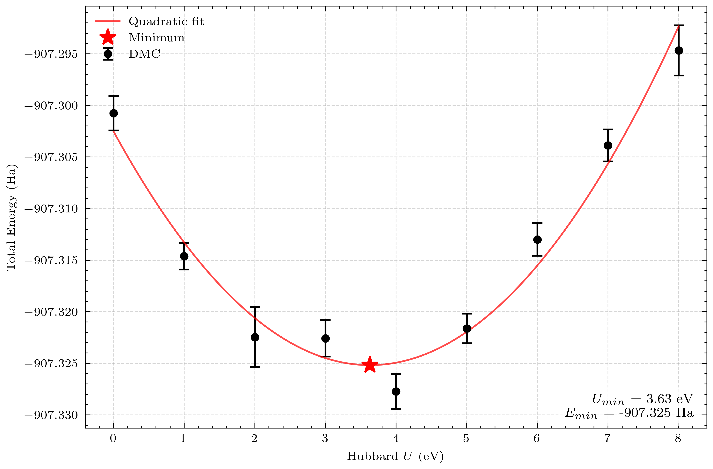

Wavefunction optimization of bulk MnSe
=====

.. _MnSe:

Aim
------------

The aim of this tutorial is to provide users with publication quality examples on calculating total energies of bulk materials using a literature derived high-throughput strategy. 

Prerequisites
----------------

This workflow assumes that you have completed the installation of Quantum Espresso (QE), QMCPACK and Nexus. Otherwise, please refer to `qmcpack.org <https://qmcpack.org>`_ for further instructions on the installation of these software. 
A basic knowledge of Nexus suite (e.g. loading modules, basic elements of Nexus workflows) is also required. Please refer to `nexus-workflows.readthedocs.io <https://nexus-workflows.readthedocs.io/>`_.

Calculations that would need to be performed in QE
^^^^^^^^^^^^^^^^

* Kinetic energy cutoff convergence study on the pseudopotentials used in the materials. Currently (2024), we mainly utilize `ccECP` potentials in most QMC calculations, which require very large (400-700 Ry) kinetic energy cutoff for accurate calculations. 

* K-point convergence study in DFT: We assume that the k-point sampling that converges the DFT total energy will be sufficient to provide similar accuracy in QMC calculations. 

Calculations that would need to be performed in QMCPACK
^^^^^^^^^^^^^^^^

* Hybrid representation calculations: Spline representation of the wavefunction can be demanding on the memory which is often more scarce for GPUs. Currently (2025), most efficient QMCPACK application stores the wavefunction memory untis that are most easily accessible to the GPU units. Therefore, hybrid representation could allow separating core and valence regions of a material to achieve a memory reduction typically around 90 \%.

Calculation steps
----------------

* Convergence tests on bulk MnSe shows that a kinetic energy cutoff of 500 Ry and a kpoint grid of (:math:`8\times8\times4`) is sufficient to achieve a resolution of 1 meV/atom on the DFT total energy. 

* DFT+U scans:
    * A pair of SCF and NSCF calculation at every U value scanned. NSCF calculation should correspond to a reasonable sized supercell (16 atoms in this example).
    * First variance and then mixed energy/reweighed variance minimization (0.95/0.05) using 2-body Jastrows and followed by the mixed cost 3-body jastrow optimization
    * Twist-averaged DMC calculations at :math:`2\times2\times2` grid. 

* Using the optimal U value, extrapolate to the infinite limit:
    * A single self-consistent field calculation of the primitive cell of the material calculated using converged DFT parameters.
    * Non self-consistent field calculations of the primitive cell at different general (non-diagonal) :math:`3\times3` supercell (tiling) vectors, but fixed k-point grid of :math:`2\times2\times2`. :math:`2\times2\times2` kgrid ensures that the calculations are performed on real twists (wavefunction has no imaginary component), thus the "real" version of the qmcpack compiler can also be used in this context. This route also reduces the memory cost of calculations by half. 
    * Jastrow optimization for each supercell size (similar to the DFT+U step)
    * Twist-averaged DMC calculations at :math:`2\times2\times2` grid for each supercell. 

.. .. figure:: ../../prep/BN_workflow.png
..    :alt: Bilayer BN workflow
..    :width: 100%
..    :align: center

..    Schematic of DFT-VMC-DMC calculation workflow for the bilayer binding energy of BN

Contents of working directory
----------------
.. code-block:: text
  
  /MnSe_tutorial
  ├── pseudos/ 
  │   ├── Mn.ccECP-soft.upf 
  │   ├── Mn.ccECP-soft.xml 
  │   ├── Se.ccECP.upf 
  │   └── Se.ccECP.xml 
  ├── README 
  ├── opt_u.py
  ├── run_library.py 
  ├── run_dmc.py 
  └── structures/ 
      └── MnSe.poscar

Complete Nexus scripts
----------------

Wavefunction optimization script (run_u.py)
^^^^^^^^^^^^^^^^^^^^^^^^^^^
.. code-block:: python

  #!/usr/bin/env python

  # user library imports
  from run_library import get_dft_settings, get_qmc_settings
  # nexus imports
  from nexus import run_project, read_structure, obj
  from nexus import generate_physical_system
  from nexus import generate_pwscf
  from nexus import generate_pw2qmcpack
  from nexus import generate_qmcpack
  from structure import optimal_tilematrix

  structure = 'structures/MnSe.poscar'
  tiling_volume                = 4
  primitive_mag_moment         = 10
  tiling_vector, tiling_wigner = optimal_tilematrix(read_structure(structure), volfac=tiling_volume)
  u_values                     = [1e-6, 1, 2, 3, 4, 5, 6, 7,8]

  system_shared = obj(
      Mn        = 15,
      Se        = 6,
  )

  qmc_shared = obj(
      pseudos      = 'Mn.ccECP-soft.xml  Se.ccECP.xml'.split()
  )

  system_prim = generate_physical_system(
      structure = read_structure(structure),
      net_spin  = primitive_mag_moment, 
      **system_shared
  )

  system_tiled = generate_physical_system(
      structure = read_structure(structure),
      tiling    = tiling_vector,
      kgrid     = (2,2,2),
      net_spin  = primitive_mag_moment * tiling_volume,
      **system_shared
  )

  for u in u_values:
      dft_shared = obj(
          kgrid     = (8,8,4),
          ecutwfc   = 500,
          pseudos   = 'Mn.ccECP-soft.upf Se.ccECP.upf'.split(),
          start_mag = obj(Mn=1),
          hubbard   = {'U' : {'Mn-3d':u}},
      )

      scf_shared, nscf_shared, conv_shared = get_dft_settings(**dft_shared)

      scf_path = 'scf_u_{}'.format(u)
      scf_run = generate_pwscf(
              system  = system_prim,
              path    = scf_path,
              
              **scf_shared
          )
      nscf_path = 'nscf_u_{}_v_{}'.format(u, tiling_volume)
      nscf_run = generate_pwscf(
          system = system_tiled,
          path = nscf_path,
          dependencies = (scf_run, 'charge_density'),
          **nscf_shared
      )        
      conv_run = generate_pw2qmcpack(
          path         = nscf_path,   
          dependencies = (nscf_run, 'orbitals'),
          **conv_shared
      )        

      dmc_path = 'dmc_u_{}_v_{}'.format(u, tiling_volume)
          
      # Optimize jastrows using the first u value listed in U-values
      if u == u_values[0]:
          j2_path = 'j2_u_{}_v_{}'.format(u, tiling_volume)
          j3_path = 'j3_u_{}_v_{}'.format(u, tiling_volume)
          j2_shared, j3_shared, dmc_shared  = get_qmc_settings(system = system_tiled, **qmc_shared)
          
          j2_run = generate_qmcpack(path = j2_path,
                                    dependencies = (conv_run, 'orbitals'),
                                    **j2_shared)

          j3_run = generate_qmcpack(path = j3_path,
                                    dependencies = (conv_run, 'orbitals'),
                                    **j3_shared)
          
      else:
          _, _, dmc_shared = get_qmc_settings(system = system_tiled, **qmc_shared)

      dmc_run = generate_qmcpack(path = dmc_path,
                                  dependencies = [(j3_run, 'jastrow'),(conv_run, 'orbitals')],
                                  **dmc_shared)
  run_project()

DMC script (run_dmc.py)
^^^^^^^^^^^^^^^^^^^^^^^^^^^
.. code-block:: python

  #!/usr/bin/env python

  # user library imports
  from run_library import get_dft_settings, get_qmc_settings
  # nexus imports
  from nexus import run_project, read_structure, obj
  from nexus import generate_physical_system
  from nexus import generate_pwscf
  from nexus import generate_pw2qmcpack
  from nexus import generate_qmcpack
  from structure import optimal_tilematrix

  structure = 'structures/MnSe.poscar'
  tiling_volumes               = [8, 12, 16]  # volumes to tile the primitive cell
  primitive_mag_moment         = 10           # net spin of the primitive cell
  u                            = 4            # Hubbard-U parameter

  system_shared = obj(
      Mn        = 15, # valence of Mn
      Se        = 6,  # valence of Se
  )

  dft_shared = obj(
      kgrid    = (8,8,4), # 8x8x4 k-points
      ecutwfc  = 500,     # 500 Ry kinetic energy cutoff
      pseudos  = 'Mn.ccECP-soft.upf Se.ccECP.upf'.split(), # pseudopotentials
      start_mag = obj(Mn=1), # initial magnetic moment for Mn
      tot_magnetization = primitive_mag_moment # total magnetization
  )

  qmc_shared = obj(
      pseudos      = 'Mn.ccECP-soft.xml  Se.ccECP.xml'.split()
  )

  scf_shared, nscf_shared, conv_shared = get_dft_settings(**dft_shared)

  system_prim = generate_physical_system(
      structure = read_structure(structure), # primitive cell structure
      net_spin  = primitive_mag_moment, # net spin of the primitive cell
      **system_shared # shared system parameters
  )

  scf_path = 'scf_u_{}'.format(u)
  scf_run = generate_pwscf(
          system = system_prim,
          path = scf_path,
          **scf_shared
      )

  for v in tiling_volumes:
      # calculate the optimal tile matrix for the given volume factor
      tiling_vector, tiling_wigner = optimal_tilematrix(read_structure(structure), volfac=v)
      print(int(primitive_mag_moment * v))
      # generate the physical system for the given volume factor
      system_tiled = generate_physical_system(
          structure = read_structure(structure),
          tiling    = tiling_vector,
          kgrid     = (2,2,2), # DMC k-point grid
          net_spin  = int(primitive_mag_moment * v), # net spin of the supercell
          **system_shared 
      )

      nscf_path = 'nscf_u_{}_v_{}'.format(u, v)
      
      nscf_run = generate_pwscf(
          system = system_tiled,
          path = nscf_path,
          dependencies = (scf_run, 'charge_density'),
          **nscf_shared
      )        

      conv_run = generate_pw2qmcpack(
          path         = nscf_path,   
          dependencies = (nscf_run, 'orbitals'),
          **conv_shared
      )        

      dmc_path = 'dmc_u_{}_v_{}'.format(u, v)        
      j2_path = 'j2_u_{}_v_{}'.format(u, v)
      j3_path = 'j3_u_{}_v_{}'.format(u, v)
      j2_shared, j3_shared, dmc_shared  = get_qmc_settings(system = system_tiled, **qmc_shared)
      
      j2_run = generate_qmcpack(path = j2_path,
                                  dependencies = (conv_run, 'orbitals'),
                                  **j2_shared)

      j3_run = generate_qmcpack(path = j3_path,
                                  dependencies = [(j2_run, 'jastrow'), (conv_run, 'orbitals')],
                                  **j3_shared)
      
      dmc_run = generate_qmcpack(path = dmc_path,
                                      dependencies = [(j3_run, 'jastrow'),(conv_run, 'orbitals')],
                                  **dmc_shared)
  run_project()

Workflow library script (run_library.py)
^^^^^^^^^^^^^^^^^^^^^^^^^^^
Here, we reuse the same user library script used in the :ref:`hBN tutorial <hBN_wf_script>`.

Work through of the Nexus scripts
----------------

The workflows in this example are managed by :code:`opt_u.py`, :code:`run_dmc.py`, while DFT and QMC settings are generated using functions imported from :code:`run_library.py`. 
Therefore, all scripts need to be in the same directory to complete the workflow. 
If you plan to use modified versions of the scripts in your own work repeatedly, you can alternatively place :code:`run_library.py` 
in a directory defined under :code:`PYTHONPATH` environment variable to make it accessible to Python interpreter. 

This workflow can provide a good starting point to write a general workflow that can be used to calculate DMC ground state energies of bulk materials. 
The workflow in this example is based on the workflow implemented in :cite:`Saritas2017` which aims to calculate the formation energies of uncorrelated solids using DMC. 
Basic structure of the scripts, especially the division of the workflow and the settings is very similar to the workflow explained in the :ref:`hBN tutorial <hBN>`, therefore will not be covered here again. 

opt_u.py
^^^^^^^^
In this script, we first optimize the single-determinant Slater-Jastrow wave function using the fixed-node DMC method. 
In the fixed-node approximation, total energies are variational with respect to the quality of the trial wave function. 
This means that if the trial wave function is equal to the exact wave function, the DMC energy will be the exact ground state energy. 
Optimizing the 3N-1 dimensional single-determinant wave function is a very expensive task. 
However, typical DFT wavefunctions are often of reasonable quality, and it is empirically observed that they benefit from cancellation of errors. 
Nevertheless, a larger portion of the fixed node errors are associated with the correlated electrons. 
Therefore, a practical approach to optimize the many-body wave function is through single parameter scans such as varying the Hubbard-U parameter or the exact exchange ratio in the hybrid functionals.
In this tutorial, we will use the Hubbard-U parameter to optimize the many-body wave function. 

Structure of the script is very similar to the :ref:`hBN tutorial <hBN_wf_script>`. Instead of scanning over the interlayer separation, we scan over the Hubbard-U parameter. 
Similarly, the J2/J3 optimization is performed only once for any given Hubbard-U parameter and then reused for all other Hubbard-U parameters. 
In this case, however, we do not extrapolate the energies to the infinite system size. 
We use a reasonably large cell with supercell of :math:`2\times2\times2` repeat units, corresponding to a 16 atom system, 
such that the optimal Hubbard-U parameter is not significantly influenced by the finite size errors. 

   DMC wavefunction optimization of bulk MnSe via DFT+U calculations

In the figure above, we plot the total energies of the optimized wavefunctions as a function of the Hubbard-U parameter. 
We find that the optimal Hubbard-U parameter is around 3.63 eV. 
In this fit, we ignored the uncertainties in the energies, therefore we do not report the uncertainty in the minimum of the quadratic fit. 
This can be done through jackknife analysis. However, the visual inspection of the fit suggests that the minima is rather wide around U values of 3-4 eV. 
Therefore, we will use U = 4.0 eV for the rest of the calculations. 

dmc.py
^^^^^^

Since the wavefunction is optimized for U = 4.0 eV in the previous step, we will use the same Hubbard-U parameter for the DMC calculations. 
This portion of the workflow is very similar to the work in :cite:`Saritas2017`. 

An important component of the workflow is the :code:`optimal_tilematrix` function. 
This function calculates the optimal tile matrix given a volume factor and primitive lattice vectors. 
The ``optimal_tilematrix`` function tries to maximize the minimum image distance between an electron in the simulation cell and its image in the neighboring cells. 
This helps to minimize the 2-body finite size errors for a given volume factor, hence helps to produce more accurate finite size extrapolations. 
In the BN example, we didn't use this function as it as a 2D material and we relied on the systematic cancellations by using diagonal supercells only. 

In this case, we optimize the J2/J3 parameters for each supercell size. 
Then the twist-averaged DMC calculations are performed for each supercell size using these jastrow parameters. 
We used a k-point grid of :math:`2\times2\times2` in all the DMC calculations. 
For a high-throughput setting, this is beneficial as one can use the "real" (not complex) version of the QMCPACK code and get 50 % memory reduction. 
It can be argued that for small supercells, this may be undersampling the Brillouin zone. 
However, it is found that these 1-body errors can be transferable from DFT to DMC, hence several correction methods are developed (which are not covered here). 

.. bibliography::

.. To retrieve a list of random ingredients,
.. you can use the ``lumache.get_random_ingredients()`` function:

.. .. autofunction:: lumache.get_random_ingredients

.. The ``kind`` parameter should be either ``"meat"``, ``"fish"``,
.. or ``"veggies"``. Otherwise, :py:func:`lumache.get_random_ingredients`
.. will raise an exception.

.. .. autoexception:: lumache.InvalidKindError

.. For example:

.. >>> import lumache
.. >>> lumache.get_random_ingredients()
.. ['shells', 'gorgonzola', 'parsley']

